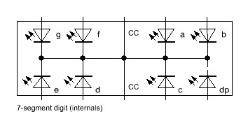
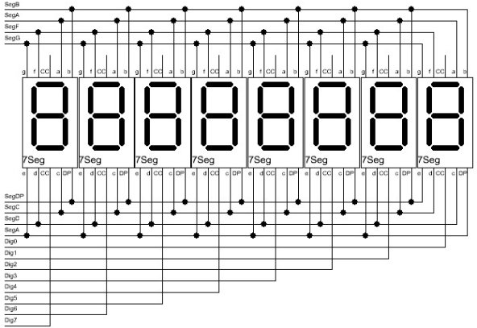

The Hardware 
============
The LedControl library supports two Maxim display drivers, the
``MAX7219`` and the ``MAX7221``. These two circuits can drive up 64
individual Led's, or 7-segment displays with 8 digits. The drivers
implement a `SPI
<http://en.wikipedia.org/wiki/Serial_Peripheral_Interface_Bus>`_
compatible slave interface that can be controlled from the Arduino
using only 3 digital output pins. An datasheet for
the IC's is available from the `Maxim homepage
<http://www.maxim-ic.com/>`_. Both drivers are very similar, so I will
use the generic term ``MAX72XX`` the ``MAX7221`` *and* the
``MAX7219``. Both drivers are still in production (Feb 2013).

This section of the documentation for LedControl library focuses on
building the hardware, and is to be considered as a supplement to the
`original datasheet
<http://www.maximintegrated.com/datasheet/index.mvp/id/1339>`_ . 
For a basic understanding I suggest you have a look at the datasheet
first and the read this section for Arduino specific information

Wiring and schematics
*********************
Here is a basic schematic for a ``MAX72XX``, showing the data signals
coming from the Arduino.
 
.. image:: MAX72XX_SPI.jpg
    :align: center

There are not yet any Leds in the schematic. There will be an extra
section on Led wiring.

Besides the ``MAX72XX`` itself and the Leds you need only 3 external
components: two capacitors (``C1``; ``C2``) and a resistor (``RSet``). 

The capacitors are there to supress noise signals introduced through
the power-supply lines. By no means these 2 capacitors can be
ommitted, as it might lead to sporadic or permanent
malfunctions. These types of errors are really hard to track
down. Both capacitors **must** be placed as near as possible to the
``V+`` and the ``Gnd`` pins of the ``MAX72XX``. 

The resistor ``RSet`` is responsible for setting an upper limit on the
current that is fed into the Leds. Selecting the correct resistor
value might not be trivial. There is an in-depth :ref:`discussion
<SelectRSet>` on this later.  

The ``MAX72XX`` has to be powered with ``+5V``. For a single
Led-matrix it is possible to use the ``+5V`` supply from the
Arduino-board. If you add more than one matrix to the Arduino you will
probably need an external power-supply. More on this in section
:ref:`Power supply issues <PowerSupply>`.

Arduino interface
+++++++++++++++++
The ``Gnd``-Pins of the ``MAX72XX`` have to be connected to one of the
``Gnd``-Pins on the Arduino board. That makes both circuits work on
the same voltage-level. The positive power-supply pins (``+5V/Vcc``)
can be connected to the Arduino-board for a limited number of
Led's.(See :ref:`Power supply issues <PowerSupply>` for details.)

The three signal lines (``DIn,CLK,Load(/CS)``) have to be connected to
three digital outputs on the Arduino board. It depends on the software
which Arduino pins have to be used. For the exact pin-numbers you have
to refer to the documentation of the library or the example code on
which you build your project. With most of the libraries for the
``MAX72XX`` you are free to choose any pins you like.

If you read the datasheet for the ``MAX72XX`` you know that the
drivers can be cascaded by simply connecting the signal ``DOut`` from
one chip to ``DIn`` on the next chip. The signals ``Clk`` and
``Load(/CS)`` have to be connected in parallel to each
``MAX72XX``. There is no strict limit as to how many drivers can be
cascaded that way. But the SPI-interface is not capable of any error
checking on the transmitted data, so you are already limited with the
length of the cables that run from one ``MAX72XX`` to the next one. If
your cables get longer than 10cm between each ``MAX72XX`` you
''might'' already run into trouble.       

Led-matrix
++++++++++
The ``MAX72XX`` can drive up to an 8x8 matrix as shown in the
schematic below. The labels on the left and the top of the schematic
refer to the matching pins of the ``MAX72XX``.

.. image:: LedMatrix.jpg
    :align: center

You can build your own matrix out of individual Leds, but there are
also pre-wired ones available. They can be directly connected to the
``MAX72XX``. Some are arranged as ''column cathode'' and some are
''column anode'' (as in the diagram above). Either type will work but
you must connect the anodes to the ``Seg`` lines and cathodes to the
``Dig`` lines and arrange your source data to suit (e.g. be prepared
to swap rows for columns).

7-segment displays
++++++++++++++++++
7-segment digits are nothing more than 8 Leds (``7-segments`` and the
``dot``) mounted in a special way. For 7-segment displays you must use
the ''common cathode''-type. There is no easy way to make a ''common
anode''-type seven segment display work with a ``MAX72XX``.

The internal wiring of a ''common cathode'' type looks like this 

If you look at the matrix schematic again that would resembles one of
the rows. The pin-labels on the 7-segment digits match the name of the
pins on a ``MAX72XX``, with the common cathode pin wired to one of the
``Dig0-7`` pins.  
In most shops you'll find only single 7-segment digits. But it is very
easy to build displays with more digits with the wiring below. 

A complete schematic
++++++++++++++++++++
A detailed schematic showing all the components is simply too large
for the computer screen. But clicking the link below will open a new
browser window with a schematic in print resolution. It shows the
wiring for 2 cascaded ``MAX72XX``. One drives a plain matrix and the
other a 7-segment display.

.. image:: MAX72XX_Schematic.jpg
    :align: center
    :scale: 50%

.. note::
   Click on the image for print-size resolution
   

``MAX7219`` vs. ``MAX7221``
***************************
Since there are only minor differences between the MAX7219 and MAX7221
how do you know which one to choose? There are two things to consider
here...

*Will I ever ever switch from the Arduino to some other type of controller for my Led matrix?*
    The ``MAX7221`` supports the standard `SPI-protocol
    <http://en.wikipedia.org/wiki/Serial_Peripheral_Interface_Bus>`_ so
    you will have no trouble driving your Led matrix from some other
    type of controller. This might be another processor board or some
    type of USB device that can act as SPI-master. The ``MAX7219`` in
    this regard deviates a little bit from the standards. But on the
    other hand all the Arduino software and libraries I have seen so
    far support both devices. If your answer is *No* here, take the
    ``MAX7219`` since it is usually a bit cheaper.

*Does your project use the analog inputs of the Arduino? Do you do some kind of audio-processing?*
    The ``MAX7221`` was designed for reduced electromagnetic
    interference (EMI).  EMI *could* lead to some jitter in the
    readings from the analog inputs of the Arduino or if the Led
    matrix is placed near some audio circuit it can introduce  audible
    noise to the signal. So, if your project would go into categories
    like : audio gadget, audio levelmeter, (low-)voltage measurement,
    etc. than better take the ``MAX7221``.

In all other cases you should be fine with the ``MAX7219``.

.. _SelectRSet:

Selecting ``RSet``
******************
The Arduino forum topics concerning the ``MAX72XX``, often show that
there is a fair bit of uncertainty when it comes to selecting a value
for the resistor RSet. It is the single component that limits the
current for all the individual Leds. While some people seem to think
of this resistor as a way to control the brightness of the Leds, its
real purpose is to protect the ``MAX72XX`` and the Leds from exessive
currents. Setting the brightness of the display can and should be done
software-controlled. 

To find out the correct value for ``RSet`` you need the datasheet for
the ``MAX72XX`` **and** the datasheet for the Ledmatrix or 
7-segment display you're going to use. 

From the datasheet of your Led's you will need only two values 

``DC forward current``
   the maximum current that is allowed to go through the Led without
   damaging it in the long run.

``Forward voltage``
   the voltage at which the Led operates.

While the ``Forward voltage`` is a fixed value which depends (mostly)
on the color of the Led, you have to limit the current going through
the Led with resistor ``RSet``. Since ``DC forward current`` is a
maximum value, which is not be exceeded, you should settle for a
slightly lower current. Standard Led's and 7-segment displays are
often rated with a ``DC forward current`` of 25-30mA. Limiting to 20mA
would make a good choice. 

With the information from the Led's datasheet we can now lookup the
resulting value for resistor ``RSet`` in the table below (which I have
copied from the ``MAX72XX`` datasheet):

====  =============== ============= ============= ============= =============
      Forward voltage 
----  --------------- ------------- ------------- ------------- -------------
ISeg  1.5V            2.0V          2.5V          3.0V          3.5V
====  =============== ============= ============= ============= =============
40mA  12.2k |omega|   11.8k |omega| 11.0k |omega| 10.6k |omega| 9.69k |omega| 
30mA  17.8k |omega|   17.1k |omega| 15.8k |omega| 15.0k |omega| 14.0k |omega| 
20mA  29.8k |omega|   28.0k |omega| 25.9k |omega| 24.5k |omega| 22.6k |omega| 
10mA  66.7k |omega|   63.7k |omega| 59.3k |omega| 55.4k |omega| 51.2k |omega| 
====  =============== ============= ============= ============= =============

Here is an example:
I have a 5x7 dots *bright red* Led matrix. The datasheet states a
``Forward voltage`` of 2.0V. The ``DC forward current`` is limited to
25mA. I'll settle for 20mA to stay a bit away from the absolute
limits. From the table above, the correct value for ``RSet`` would be
28.0k |omega|. You might have trouble finding that exact value in
shops, but it is always safe to go for higher values. More common
values would be 30k |omega| or 33k |omega|. The Leds will look a bit
dimmer with these values, but since it affects all the Led's in the
matrix in the same way, you will probably not even notice the
difference. It also reduces the supply current which is 
good news if your project runs on batteries.

Mixing Leds of different colors in a matrix is not really recommended
with the ``MAX72XX``. There is only one resistor ``RSet`` that limits
the current for all the Leds. After you have looked all the different
resistors required by your Led colors you will have to settle for the
highest value. The brightness of the Leds with different colors will
not really match, so it's a ''trial and error'' thing finding the
right Leds.

.. _PowerSupply:

Power supply issues
*******************
Now that we know how much current is going through one Led in the
matrix, the next thing you might ask yourself is :
*How much current will the whole matrix draw from the power supply?*

This really depends on the number of Leds which are lit in a '''row'''
of the matrix at the same time. Let's look at the schematic of the Led
matrix again. A row is made of 8 Leds the connected cathodes (two of
them are marked in the schematic). 

.. image:: LedMatrixRowsMarked.jpg
    :align: center

Internally the ``MAX72XX`` multiplexes the rows of the
matrix. Multiplexing means : The drivers switches between the rows of
the matrix very fast (about 800 times a second). That gives the
impression all the Leds are constantly on, while in reality they just
flicker very, very fast. The big advantage of this trick is that at
every single point of time no more than 8 Leds (one row) are lit. The
maximum current that a single matrix will ever demand is 8 times the
current you have set with resistor ``RSet`` (+ some 10mA for the
``MAX72XX`` itself).

In the example from section :ref:`Select RSet <SelectRSet>`
we choose a value that limits the Led current to 20mA. If our software
now lights up all the 64 Leds in the Matrix at the same time, we still
have to supply only 170mA, because of multiplexing.

   ``PeakCurrent=(8 x LedCurrent) + MAX72XX-Supply``

   ``PeakCurrent=(8 x 20mA) + 10mA = 170mA``

If your code never drives more than let's say 4 of the Leds in any of
the rows, you will consequently have to supply only half the current. 

 
Powering the Leds from the USB-port
+++++++++++++++++++++++++++++++++++
Depending on the type of USB-hub you're using, there are different
limits as to how much current can be drawn from a single USB-port.  

*The root hub*
    This is the USB-hub on your computer. On a desktop machine it will
    deliver up to 500mA on every USB-port. Some notebooks implement
    power saving strategies that limit the maximum current to 100mA as
    soon as it is unplugged from mains and runs on batteries. 

*External self-powered hub*
    This kind of USB-hub brings its on power-supply unit. Like the
    root hub, you can draw 500mA from each port. Some of these
    self-powered hubs supply the current, even when your computer is
    turned off or you unplug the hub itself. But sadly this is often
    not even mentioned in the datasheet of the hub. I have 3
    self-powered hubs. One switches the USB-ports off when my machine
    shuts down or I unplug the hub. The other two don't care about
    this, the 5V supply on the USB-port is always alive.  

*External bus-powered hub*
    These hubs don't bring their own power-supply and therefore they
    will deliver not more than 100mA per USB-port. This type of hub is
    not really suitable for any Ardunino project with external
    hardware to be powered from USB.

Of the three, only the root and self-powered hubs that supply up to
500mA are recommended. As was said before the actual current your
hardware draws depends very much on the software you write. 

Here is the worst-case scenario: There are times when all 64 Leds are
`on` at the same time and you selected resistor ``RSet`` that allows a
current of 20mA per Led. That will add up to a maximum current of
170mA per matrix. With two of these matrices you're at 340mA. Now add
another 40mA for the arduino itself and you'll end up with
380mA. There is not enough headroom for adding third matrix in this
case.

But if you light up only a single Led at any time, your maximum
current is at 30mA. You can easily drive 15 ``MAX72XX`` and the
Arduino from a 500mA hub. 

Powering the Leds from batteries
++++++++++++++++++++++++++++++++
Its hard to come up with numbers as to how long a battery will last. So here are
just a few guidelines:

- Every Led that is **not** lit saves power. 
- Selecting a higher value for ``RSet`` makes the display dimmer, 
  but also reduces the current going through the Leds.
- Use software features to reduce the brightness of the matrix to a tolerable minimum.

Here is the result from a test I did with a 9V battery that had a
capacity of 625mAH and a Led matrix on which 32 out of the 64 Leds
where lit all the time. The whole setup with the matrix and the
Arduino (model NG Rev.C) consumed a static current of 78mA. After
about 55 minutes all the Leds went off. The voltage on the battery had
dropped below 7.4V. By that time the Arduino was still running, but
the ``MAX72XX`` was not able to drive the Leds any more. 

.. |omega| unicode:: 0x03A9
   :ltrim:
