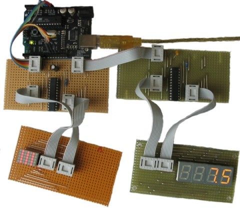

.. LedControl documentation master file, created by sphinx-quickstart on Mon Feb
   4 12:31:17 2013.  You can adapt this file completely to your liking, but it
   should at least contain the root `toctree` directive.

The Arduino LedControl library
==============================
The LedControl library provides methods to control a ``MAX7221``
or a ``MAX7219`` chip which are both used to that drives a Led matrix 
or a 7-segment display from an Arduino board.  

A detailed description of the hardware and a
schematic can be found ``here``.

As a teaser here is a picture of my rather crappy (but working) testbed...

The LedControl library is not the first attempt to write . There is already a
library and a lot of code-examples for the Arduino and the MAX72XX available,
but the focus had always been on controlling Leds layed out in some sort of
rectangular matrix. I use the MAX72XX to drive 7-segment displays, so I wanted a
function to display numbers (decimal and hexa-decimal) and also the limited set
of alphanumeric characters that make (visual) sense on this kind of
displays. But the library also provides a basic set of functions by which either
individual or groups of Leds can be switched on and off.

.. toctree::
   :maxdepth: 2
   
   hardware.rst
   software.rst
   demos.rst
