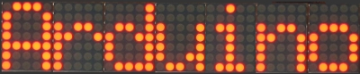
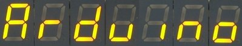

.. LedControl documentation master file, created by sphinx-quickstart on Mon Feb
   4 12:31:17 2013.  You can adapt this file completely to your liking, but it
   should at least contain the root `toctree` directive.

The Software library
====================
The LedControl library is not the first attempt to write  . There is already a
library and a lot of code-examples for the Arduino and the MAX72XX available,
but the focus had always been on controlling Leds layed out in some sort of
rectangular matrix. I use the MAX72XX to drive 7-segment displays, so I wanted a
function to display numbers (decimal and hexa-decimal) and also the limited set
of alphanumeric characters that make (visual) sense on this kind of
displays. But the library also provides a basic set of functions by which either
individual or groups of Leds can be switched on and off.

Creating a LedControl instance 
****************************** 

All the libraries API-functions are called through a variable of type
``LedControl`` which you have to create inside your projects code.

A typical code for library initialization will look like this :

.. code-block:: c

   /* We start by including the library */ 
   #include "LedControl.h"
   
   /*
    * Now we create a new LedControl.
    * We use pins 12,11 and 10 on the Arduino for the SPI interface
    * Pin 12 is connected to the DATA IN-pin of the first MAX7221
    * Pin 11 is connected to the CLK-pin of the first MAX7221
    * Pin 10 is connected to the LOAD(/CS)-pin of the first MAX7221
    * There will only be a single MAX7221 attached to the arduino 
    */  
    LedControl *lc1=LedControl(12,11,10,1);

The first step is obvious. We have to include the ``LedControl``-library.

Then we create an instance of type ``LedControl`` through which we ''talk'' to
the MAX72XX devices. The initialization of an ``LedControl`` takes 4
arguments. The first 3 arguments are the pin-numbers on the Arduino that are
connected to the MAX72XX. You are free to choose any of the digital IO-pins on
the arduino, but since some of the pins are also used for serial communication
or have a led attached to them its best to avoid pin 0,1 and 13. I choose pins
12,11 and 10 in my example. The library does not check the pin-numbers to be
'''valid''' in any way. Passing in something stupid (pin 123??) will break your
app.  You don't have to initialize the pins as outputs or set them to a certain
state, the library will do that for you.

The fourth argument to ``LedControl(dataPin,clockPin,csPin,numDevices)`` is the
number of cascaded MAX72XX devices you're using with this ``LedControl``. The
library can address up to 8 devices from a single ``LedControl``-variable. There
is a little performance penalty implied with each device you add to the chain,
but amount of memory used by the library-code will stay the same, no matter how
many devices you set. Since one ``LedControl`` cannot address more than 8
devices, only values between 1..8 are allowed here.

Here is the prototype for a new ``LedControl``-instance:

.. code-block:: c

   /*
    * Create a new controler
    * Params :
    * int dataPin The pin on the Arduino where data gets shifted out
    * int clockPin The pin for the clock
    * int csPin The pin for selecting the device when data is to be sent
    * int numDevices The maximum number of devices that can be controled 
    */
    LedControl(int dataPin, int clkPin, int csPin, int numDevices);

If you need to control more than 8 MAX72XX, you can always create another
``LedControl``-variable that uses 3 different pins on your arduino-board.  The
only thing you have to do is to initialize another ``LedControl``

.. code-block:: c

    /* we have to include the library */ 
    #include "LedControl.h"
    
    // Create a LedControl for 8 devices...  LedControl
    lc1=LedControl(12,11,10,8);
    
    // ... and another one. Now we control 1024 Leds's from an arduino, not bad!
    // Note : the second one must use different pins!  LedControl
    lc2=LedControl(9,8,7,8);

There is no way to read the pin-numbers from your code, but there is a function
that requests the maximum number of devices attached to an ``LedControl``. This
can be very handy when you want to loop over the full list of MAX72XX devices
attached. Here is a piece of code that switches all of the MAX72XX-devices from
power saving mode into normal operation. I'll think you'll get the idea even
though we haven't talked about the ``shutdown(addr)`` function yet...

.. code-block:: c 

    #include "LedControl.h"
    
    // Create a new LedControl for 5 devices...  LedControl
    lc1=LedControl(12,11,10,5);
    
    void setup() { 
        for(int index=0;index<lc1.getDeviceCount();index++) {
            lc1.shutdown(index,false); 
        } 
    }

We iterate over the list of devices by an index that runs from 0 to
``getDeviceCount()-1``. That would be 0 to 4 in this piece of code. The index is
the ''address'' of each device. This ''address'' will be the first argument of
'''every''' function that sets a feature or a new (Led-)value on a device.  Keep
in mind that ``getDeviceCount()`` returns the number of devices attached, but
the address of an device starts at 0 for the first one, 1 for the second
one,.. ``getDeviceCount()-1`` for the last one. Here is the prototype of the
function:

.. code-block:: c

    /*
     * Gets the maximum number of devices attached to this LedControl.
     * Returns :
     * int the number of devices attached to this LedControl 
     */ 
    int LedControl::getDeviceCount();

Power saving mode 
***************** 

Leds consume quite a lot of energy when they are lit. For battery operated
devices you'll definitly want to save power by switching the whole display off,
when the user does not need it. A special command sequence can put the MAX72XX
into shutdown mode.

The device will switch off all the Led's on the display, but the data is
retained. You can even continue to send new data during shutdown mode. When the
device is activated later on, the new data will appear on your display. Here is
an example for an *invisible* countdown on a 7-segment display:

.. code-block:: c

    //create a new device LedControl lc=LedControl(12,11,10,1);
    
    void countDown() { 
        int i=9; 
	lc.setDigit(0,(byte)i,false); 
	//now we see the number '9' 
	delay(1000); 
	//switch the display off ...
        lc.shutdown(0,true); 
	//and count down silently 
	while(i>1) { 
	    //data is updated, but not shown 
	    lc.setDigit(0,(byte)i,false); 
	    i--; 
	    delay(1000); 
        }
        //when we switch the display on again we have already reached '1'
        lc.shutdown(0,false); 
	lc.setDigit(0,(byte)i,false); 
    }

Here is the prototype for method ``LedControl.shutdown(addr)``

.. code-block:: c

    /*
     * Set the shutdown (power saving) mode for the device
     * Params :
     * int addr The address of the display to control
     * boolean b If true the device goes into power-down mode. If false
     *            device goes into normal operation 
     */ 
    void shutdown(int addr, bool b);

Please note that the ``MAX72XX`` is **always** in shutdown mode when the Arduino is
powered up.

Limiting the number of digits (ScanLimit)
***************************************** 

*(This is a kind of experts feature not really needed by most users of the
library. Since the library initializes the* ``MAX72XX`` *to safe default values,
you don't have to read this section just to make your hardware work)*

When a new LedControl is created it will activate all 8 digits on all
devices. Each *lit* digit will be switched on for 1/8 of a second by the
multiplexer circuit that drives the digits. If you have any reason to limit the
number of scanned digits, this is what happens : The Led's get switched on more
frequently, and therefore will be on for longer periods of time. Setting the
scan limit to 4 would mean that a lit Led is now switched on for 1/4 of a
second, so the ``MAX72XX`` has to provide the current on the segment-driver for
a longer period of time.

You should read the relevant section of the ``MAX72XX`` datasheet carefully! Its
actually possible to **destroy** a ``MAX72XX`` by choosing a bad combination
of resistor ``RSet`` that limits the current going through the Led's
and the number of digits scanned by the device.  The only reason to
tweak the scanlimit at all, is that the display looks too
dark. But this is most likely due to the fact that you haven't raised
the intensity (see :ref:`Setting display brightness<SetupBrightness>`)
on startup. Anyway, here's the prototype of ``setScanLimit()`` for
those who need it:

.. code-block:: c

    /*
     * Set the number of digits (or rows) to be displayed.
     * See datasheet for sideeffects of the scanlimit on the brightness
     * of the display.
     * Params :
     * int addr The address of the display to control
     * int limit The number of digits to be displayed
     * Only values between 0 (only 1 digit) and 7 (all digits) are valid.  
     */
    void setScanLimit(int addr, int limit);

.. _SetupBrightness:

Setting display brightness
************************** 

There are three factors that determine the brightness of your display.

- the value of resistor [[Main.MAX72XXHardware#SelectRSet | ``RSet``]] which
  limits the maximum current going through the Led's.
- the [[#SetupScanLimit | scan limit]] of the display. ''(If you read the
  section, you already know that I'd recommend to leave this option its safe
  default.)''
- and a comand that allows the brightness of the Leds to be controlled from
  software.

The ``setIntensity(int addr, int intensity)`` method lets you control brightness
in 16 discrete steps. Larger values make the display brighter up to the maximum
of 15. Values greater than 15 will be discarded without changing the intensity
of the Leds.  You might be surprised to find out that an intensity of zero will
not switch the display completely off, but we already know how to do this with
the [[#SetupPower | ``shutdown()``]]-function.

.. code-block:: c

    /*
     * Set the brightness of the display.
     * Params:
     * int addr the address of the display to control
     * int intensity the brightness of the display.
     *               Only values between 0(darkest) and 15(brightest) are valid.
     */ 
    void setIntensity(int addr, int intensity);

Device initialization 
********************* 

When a new ``LedControl`` is created the library will initialize the hardware
with ...

- the display blanked
- the intensity set to the minimum
- the device to be in power saving mode
- the maximum number of digits on the device activated

A blanked display is probably what everybody wants on startup. But with the
intensity at a minimum and the device in shutdown-mode no Leds will light up in
the startup configuration. Most users will do their own initialization inside
the ``setup()``-function. Here is a piece of code that can be used as a template
for creating an ``LedControl`` that is ready to light up Leds at a medium
brightness as soon as display data arrives.

.. code-block:: c

    //we have to include the libary 
    #include "LedControl.h"
    
    //and create the LedControl 
    LedControl lc=LedControl(12,11,10,1);
    
    void setup() { 
        //wake up the MAX72XX from power-saving mode
        lc.shutdown(0,false); 
        //set a medium brightness for the Leds
        lc.setIntensity(0,8); 
    }

Clearing the display 
******************** 

Before we start to light up Leds there is one more thing:
``LedControl.clearDisplay(addr)``! It should be obvious what the functions
does...

.. code-block:: c

    /*
     * Switch all Leds on the display off.
     * Params:
     * int addr The address of the display to control 
     */ 
    void clearDisplay(int *addr);

All Led's off after this one, that's it...

Controlling a Led matrix 
************************

Ok, I made this one up, but with 8 ``MAX72XX`` you could create a textdisplay
for 12 characters. The picture of my test-setup at the top of the article
reveals that I have only single 5x7 matrix. But this cheap display is fine for
testing the basic concepts of the ``LedControl`` library.

There are 3 different ways to switch a Led in a Matrix on or off. We start with
a function that controls each one of the Led's individually...

Control a single Led 
++++++++++++++++++++ 

Here is the prototype for the function that switches Leds on or off.

.. code-block:: c

    /*
     * Set the status of a single Led.
     * Params :
     * addr address of the display
     * row the row of the Led (0..7)
     * col the column of the Led (0..7)
     * state If true the led is switched on,
     *	     if false it is switched off 
     */ 
    void setLed(int addr, int row, int col, boolean state);

The ``addr`` and the ``state`` arguments should be clear, but what excatly is a
``row`` and what is a ``column`` on the matrix? It really depends on the wiring
bewteen the ``MAX72XX`` and your matrix. The ``LedControl``-library assumes the
setup used in this schematic:

.. image:: LedMatrix.jpg
    :align: center

There are 8 rows (indexed from 0..7) and 8 columns (also indexed from 0..7) in
the matrix. If we want to light up the Led which is located at the very right of
the 3'rd row from the top, simply take the index of the Led (2.7) and use is as
the row and column arguments.

Here's some code that lights up a few Leds

.. code-block:: c

    //switch on the led in the 3'rd row 8'th column 
    //and remember that indices start at 0!  
    lc.setLed(0,2,7,true); 
    //Led at row 0 second from left too
    lc.setLed(0,0,1,true); 
    delay(500); 
    //switch the first Led off (second one stays on) 
    lc.setLed(0,2,7,false);

``setLed()`` is fine if you light up only a few Leds, but if more Leds need to
be updated, it would require many lines of code. So there are two more functions
in the library, that control a complete row and column with a single call.
    
Control a row 
+++++++++++++ 

The ``setRow(addr,row,value)``-function takes 3 arguments. The first one is the
already familiar address of our device. The second one is the row that is going
to be updated and the third one the value for this row.

But how do we know which Leds light up for a specific value? The value, a byte,
uses a simple encoding where each bit set to 1 represents a lit led and an unset
bit a Led switched off. Here is an example:

We want to light up the marked Leds from the schematic...

.. image:: LedMatrixSetRow.jpg
    :align: center

The index for the row to be updated is 2. Now we have to set the byte-value for
the Leds to be lit. The easiest approach is to include the standard header-file
``<binary.h>`` to your sketch. Now you can write down the value in binary encoding
and have an exact mapping between bits set to 1 and the Leds to be switched on.
To light up the the Leds from the example we could simply write:

.. code-block:: c

    //include this file so we can write down a byte in binary encoding 
    #include <binary.h>

    //now setting the leds from the third row on the first device is easy
    lc.setRow(0,2,B10110000);

If for any reason you can not specify the value in binary encoding, here is a
simple table that maps the decimal values of each bit to the Led it affects. The
two rows at bottom give an example for how to calculate the decimal value for
the example from above.

========= ======= ======= ======= ======= ======= ======= ======= ======= 
          Led 2.0 Led 2.1 Led 2.2 Led 2.3 Led 2.4 Led 2.5 Led 2.6 Led 2.7 
--------- ------- ------- ------- ------- ------- ------- ------- ------- 
Bit-Value     128      64      32      16       8       4       2       1 
       On     Yes      No     Yes     Yes      No      No      No      No 
Row-Value     128       0      32      16       0       0       2       0 
========= ======= ======= ======= ======= ======= ======= ======= ======= 

=176 (128+32+16) 

Inside your code you would use ``lc.setRow(0,2,176)`` to update this row on the
first ``MAX72XX`` attached to the Arduino. As a side-effect the
``setRow()``-call is much faster than calling ``setLed()`` in turn for each
Led. So use this method whereever you can.

Here is the signature of the method :

.. code-block:: c

    /*
     * Set all 8 Led's in a row to a new state
     * Params:
     * addr address of the display
     * row row which is to be set (0..7)
     * value each bit set to 1 will light up the corresponding Led.  
     */ 
    void setRow(int addr, int row, byte value);

Control a column 
++++++++++++++++ 

What can be done for ''rows'' can likewise be done with ''columns''. The
``setColumn()``-method updates 8 Leds in the vertical columns.

Here is an example.

.. image:: LedMatrixSetCol.jpg
    :align: center

This time we want the 4 leds at the bottom of column 6 to be lit. We can use the
the binary encoding again. Here the leftmost bit in the value refers to the Led
at the top of the column:

.. code block:: c

    //include this file so we can write down a byte in binary encoding
    #include <binary.h>

    //now setting the leds from the sixth column on the first device
    is easy lc.setColumn(0,5,B00001111);

and here is the table that maps bits to the Leds for columns:

.. list-table:: Match Rows
    :header-rows: 1

    * -
      - Led 0.5
      - Led 1.5
      - Led 2.5
      - Led 3.5
      - Led 4.5
      - Led 5.5
      - Led 6.5
      - Led 7.5
    * - Bit_value
      - 128
      - 64
      - 32
      - 16
      - 8
      - 4
      - 2
      - 1
    * - On
      - No
      - No
      - No
      - No
      - Yes
      - Yes
      - Yes
      - Yes
    * - Col-Value
      - 0
      - 0
      - 0
      - 0
      - 8
      - 4
      - 2
      - 1
 

.. csv-table:: Match Rows

    :header: "","Led 0.5","Led 1.5","Led 2.5","Led 3.5","Led 4.5","Led 5.5","Led 6.5","Led 7.5" 
    "Bit-Value","128","64","32","16","8","4","2","1"
    "On","No","No","No","No","Yes","Yes","Yes","Yes"
    "Col-Value","0","0","0","0","8","4","2","1"

=15 (8+4+2+1) 

The signature of the method is almost the same a the row-version of it:

.. code-block:: c

    /*
     * Set all 8 Led's in a column to a new state
     * Params:
     * addr address of the display
     * col column which is to be set (0..7)
     * value each bit set to 1 will light up the corresponding Led.
     */ void setColumn(int addr, int col, byte value);

A complete example for the Led matrix functions can be found on the `demo-page
<http://example.com>`_ for the library.

.. note :: **A note on performance...**

    There is an important difference between the way the ``setRow()-`` and the
    ``setColumn()-`` methods update the Leds:

    - ``setRow()`` only needs to send a single ``int``-value to the ``MAX72XX``
      in order to update all 8 Leds in a row.
    - ``setColumn()`` uses the ``setLed()``-method internally to update the
      Leds.  The library has to send 8 ``ints`` to the driver, so there is a
      performance penalty when using ``setColumn()``. You won't notice that
      visually when using only 1 or 2 cascaded Led-boards, but if you have a
      long queue of devices (6..8) which all have to be updated at the same
      time, that could lead to some delay that is actually visible.

Control 7-Segment displays 
************************** 
It's not the standard usage for 7-segment Leds...

but looks good!

Print numbers 
+++++++++++++ 
The most common use of 7-segment displays is to show numbers. The
first function we look at, takes an argument of type byte and prints
the corresponding digit on the specified column. The range of valid
values runs from 0..15. All values between 0..9 are printed as digits,
values between 10..15 are printed as their hexadecimal equivalent.

Any other value will simply be ignored, which means '''nothing''' will be
printed. The column on nthe display will not be blanked, it will simply retain
its last valid value. The decimal point on the column can be switched on or off
with an extra argument.

Here is a small example that prints an int value (-999..999) on a display with 4
digits.

.. code-block:: c

    void printNumber(int v) {  
        int ones;  
        int tens;  
        int hundreds;
    	boolean negative;

	if(v < -999 || v > 999)  
            return;  
        if(v<0) {  
            negative=true;
    	    v=v*-1;  
        } 
        ones=v%10;  
        v=v/10;  
        tens=v%10;  
        v=v/10;
    	hundreds=v;  
        if(negative) {  
            //print character '-' in the leftmost column  
            lc.setChar(0,3,'-',false);  
        } else {
    	    //print a blank in the sign column  
            lc.setChar(0,3,' ',false);  
        }  
        //Now print the number digit by digit
    	lc.setDigit(0,2,(byte)hundreds,false);
    	lc.setDigit(0,1,(byte)tens,false);
    	lc.setDigit(0,0,(byte)ones,false); }

This is the prototype for the function:

.. code-block:: c

    /*
     * Display a (hexadecimal) digit on a 7-Segment Display
     * Params:
     * addr address of the display
     * digit the position of the digit on the display (0..7)
     * value the value to be displayed. (0x00..0x0F)
     * dp sets the decimal point.  
     */  
    void setDigit(int addr, int *digit, byte value, *boolean dp);

The ``digit``-argument must be from the range 0..7 because the MAX72XX can drive
up to eight 7-segment displays. The index starts at 0 as usual.

Print characters 
++++++++++++++++ 
There is a limited set of characters that make (visual) sense on a
7-segment display. A common use would be the character '-' for
negative values and the 6 characters from 'A'..'F'
for hex-values.

The ``setChar(addr,digit,value.dp)``-function accepts a value of type char for
the whole range of 7-bit ASCII encoding. Since the recognizable patterns are
limited, most of the defined characters will be the ``<SPACE>``-char. But there
are quite a few characters that make sense on a 7-segment display.

Here is the set of printable characters:

 - ``0 1 2 3 4 5 6 7 8 9``
 - ``A a`` (prints upper case)
 - ``B b`` (prints lower case)
 - ``C c`` (prints lower case)
 - ``D d`` (prints lower case)
 - ``E e`` (prints upper case)
 - ``F f`` (prints upper case)
 - ``H h`` (prints upper case)
 - ``L l`` (prints upper case)
 - ``P p`` (prints upper case)
 - ``-`` (the minus sign)
 - ``.,`` (lights up the decimal-point)
 - ``_`` (the underscore)
 - ``<SPACE>`` (the blank or space char)

For your conveniance, the hexadecimal characters have also been redefined at the
character values 0x00...0x0F. If you want to mix digits and characters on the
display, you can simply take the same byte argument that you would have used for
the ``setDigit()``-function and it will print the hexadecimal value.

The prototype of the function is almost the same as the one for displaying
digits.

.. code-block:: c

    /*
     * Display a character on a 7-Segment display.
     * There are only a few characters that make sense here :
     * '0','1','2','3','4','5','6','7','8','9','0',
     * 'A','b','c','d','E','F','H','L','P',
     * '.','-','_',' '
     * Params:
     * addr address of the display
     * digit the position of the character on the display (0..7)
     * value the character to be displayed.
     * dp sets the decimal point.  
     */ 
    void setChar(int addr, int digit, char value, *boolean dp);i

Commented demos for the library 
******************************* 
Some commented demos for the ``LedControl``-library are on page [[LedControlDemos]]. You can
also download the code for the demos from [[LedControlDemos | there]].
    
Sourcecode and download 
*********************** 
The sourcecode of the library is available as a zip-file : `LedControl.zip <http://arduino.cc/playground/uploads/Main/LedControl.zip>`_

The zip-file will create a new directory named LedControl with 3 files:

``LedControl/LedControl.h`` 
    The header to be included into your project
``LedControl/LedControl.cpp`` 
    The implementation of the functions
``LedControl/keywords.txt`` 
    installs syntax highlighting for the library

You have to unpack the zip-file into the library directory of your arduino
environment.  The location of the library directory has changed with more recent
versions of the arduino environment.

- If you are running a version from ``0007`` up to ``0009`` the libraries are
  located at ``arduino-<version>/lib/targets/libraries/``
- Starting with version ``0010`` the Arduino IDE expects libraries to be
  installed at ``arduino-<version>/hardware/libraries/``

When the file `LedControl.zip <http://arduino.cc/playground/uploads/Main/LedControl.zip>`_
has been unpacke into one of the directory from above, the new library has to be compiled. From
the arduino-ide this is very simple. Create a new sketch with the following
content...

.. code-block:: c

    #include "LedControl.h"
    
    void setup() {
    } 

    void loop() {
    }

... hit the verify button. Now the library will be compiled and is available for
  all of your sketches that start with a ``#include "LedControl.h"`` line.

The Zip-File also contains 3 example sketches which are documented on the
`LedControlDemos <demos>`_ page.

